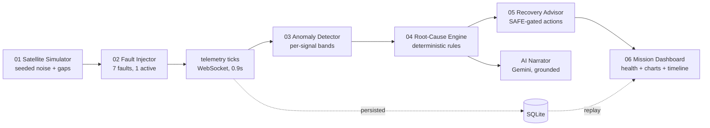

# ORBITWIN

### *Break the twin, spare the spacecraft.*


**Orbitwin (Twin Lab MVP)** is a mission-grade satellite digital twin for **ST-09 · Predictive Fault Simulation**. A living software model of ORBITER-01, kept in step with simulated telemetry — so operators can ask *"what if"* without ever touching the spacecraft.

The value is in the **links between subsystems**: a degrading battery drags down bus voltage, which forces heaters on, which cooks the thermal loop, which degrades comms. This is not a dashboard that shows each subsystem separately. **This is a twin.**

```
INJECT  →  SIMULATE  →  DETECT  →  DIAGNOSE  →  PREDICT  →  RECOVER  →  REPLAY  →  RECORD
```

---

## The 2-minute demo (this wins hackathons)

> 1. **(0:00)** Open Orbitwin. All green, Health 78%, telemetry *breathing*. "ORBITER-01, live."
> 2. **(0:20)** Select **Battery Degradation** → **INJECT FAULT**. "A real backend incident — not a video."
> 3. **(0:25–1:00)** Hands off. Narrate the order: *"Battery falls first… voltage follows… heaters kick in… temperature climbs… comms degrades last. That order IS the EPS → TCS → COMMS physics."*
> 4. **(1:00)** "Detected. Chain traced. Severity HIGH. Temp critical in ~4 sim-minutes without action." Open the **AI Insight panel** — what broke, why, the chain, the fix.
> 5. **(1:20)** **APPLY RECOVERY.** "Watch it save itself — 61 back to 73."
> 6. **(1:50)** Reports → **Replay**: *"That exact failure, replayed from recorded telemetry."* → Open report → Print to PDF. *"Every number traceable. Thank you."*

Don't believe it's live? Inject a *different* fault. The cascade, diagnosis, RUL and recovery all change — a recording can't do that.

---

## Live pipeline (nothing is pre-played)



Every pixel change on screen is a WebSocket tick from the backend, persisted to SQLite. **Replay** re-renders any incident frame-by-frame from stored telemetry. Incident IDs, timestamps and report contents always match what just happened.

---

## Fault catalog — every one cascades across 3+ subsystems

| Fault | Severity | Cascade | Aftermath |
|---|---|---|---|
| Battery Degradation | HIGH | Battery → Voltage → Heaters → Temp → Comms | 64→42% SoC, 32→58°C, 87→62% signal |
| Power Bus Failure | CRITICAL | Bus → Power → Battery → Thermal → Comms | power 78→41% |
| Solar Power Drop | MEDIUM | Solar → Charging → SoC → Power → Payload | solar 52→22 W |
| Thermal Runaway | CRITICAL | Temp → Protection → Payload → Comms → Safe-mode | temp 32→71°C |
| Communication Loss | HIGH | Signal → Packets → Data rate → Visibility | signal 87→12%, flagged *visibility lost — craft may be healthy* |
| Attitude Drift | HIGH | Attitude → Pointing → Solar → Signal → Battery | solar 52→28 W |
| Sensor Failure | HIGH | Sensors → Attitude → Solar → Power → Comms | Sensors CRITICAL |

One active fault at a time (`409 Resolve the active incident…` otherwise — it's a real state machine). Same input → same output, always. Idle stream breathes with seeded sub-1% noise.

---

## Quickstart — from zero to breaking things in 3 minutes

**Backend:**
```powershell
python -m pip install -r backend/requirements.txt
uvicorn app.main:app --app-dir backend
# → http://localhost:8000 · interactive docs at /docs
```

**Frontend:**
```powershell
cd frontend; npm install; npm run dev
# → http://localhost:5173 (API proxied, WS → ws://host:8000/ws/simulation)
```

**Tests:** `python -m pytest backend/tests -v` — determinism, recovery, noise bounds, RUL, invalid-fault rejection.

**AI Narrator (optional, offline-first):** create `backend/.env` with `GEMINI_API_KEY=` (or paste it in Settings → saved server-side only). Without a key the deterministic diagnosis renders anyway — the demo *never* needs the internet.

---

## API

| | |
|---|---|
| `GET /api/mission /api/state /api/faults /api/telemetry /api/events /api/incidents /api/analysis` | live twin state |
| `POST /api/faults/inject {"fault_type":"battery_degradation"}` | **break it** → `INC-2026-xxxx`, `SIMULATING` |
| `POST /api/incidents/{id}/recover` | **save it** — recovery ticks stream back |
| `GET /api/incidents/{id}/report` | printable incident report → PDF |
| `POST /api/incidents/{id}/explain` | AI diagnosis (cached per incident) |
| `POST /api/reset` | back to nominal, history preserved |
| `WS /ws/simulation` | `INJECTED → … → RECOMMENDATION_READY`, then recovery ticks |

---

## Why judges should care

- **Beats the trap.** The failure mode of this problem statement is *an isolated dashboard with no cause-and-effect*. Ours is all cause-and-effect: delete the coupling tables and there is no product.
- **Fidelity, honestly framed.** Bounded LEO EPS/TCS magnitudes, seeded noise, out-of-envelope values flag instead of rendering silently, RUL projected at observed slope in honest sim-minutes.
- **Explainable by design.** Deterministic core, no API key required. Gemini is a *narrator*, grounded strictly on real deltas — never the source of truth.
- **Traceable.** Incident ID → event log → telemetry frames → replay → report. One thread, end to end.

**Judge Q&A, answered in the repo:**
- *Which three subsystems, what connects them?* — EPS→TCS→COMMS coupling rules (SoC→voltage→heaters→temp→comms amps), ADCS/Sensors in attitude/sensor faults.
- *Synced twin or pretty simulation?* — Synchronized; Replay proves it.
- *How checked believable?* — 9 automated checks + envelope-bounded magnitudes.

---

## Roadmap — from demo to real program

> Tonight: deterministic twin. Next: TimescaleDB + SimPy/OpenModelica physics, Basilisk dynamics, NASA battery-ageing datasets to calibrate RUL, Kalman state estimation, 3D view.

```
project
├── frontend/  React + Vite + TS · original mission-control CSS, verbatim
│   └── src/{components,pages,hooks,services,types,data,styles}
└── backend/   FastAPI + SQLModel + SQLite · WebSocket ticks
    └── app/{simulation,faults,ai,reports,api,database}
```

Built the night before the hackathon. Flown like it was always meant to fly.
